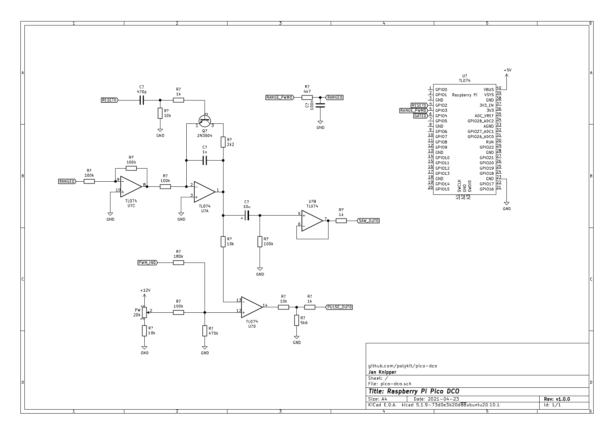
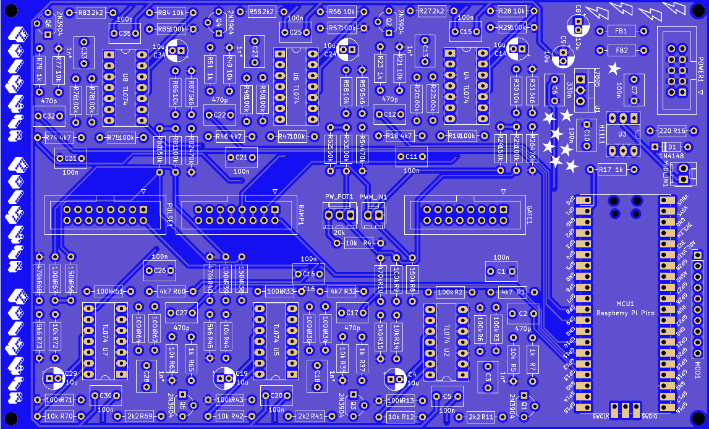

# Raspberry Pi Pico Polyphonic DCO

This repository contains source code, schematics and PCB for a digitally controlled oscillator (DCO) with up to 6 voices which are driven by a Raspberry Pi Pico. It uses PIO to generate a highly accurate frequency which is controlled by USB or serial MIDI. The analog oscillator part is based on the Juno 106 and generates sawtooth and square wave signal with a 10Vpp amplitude. Amplitude compensation is done by a smoothed PWM signal coming from the Pico.

## Key features

- Digitally controlled analog oscillator using a Raspberry Pi Pico
- Up to six voices
- Voice stacking
- Detuning of voices
- Separate gate signal
- DIN MIDI serial input
- USB MIDI input
- MIDI pitch bend
- Portamento with adjustable speed

This is how it sounds: [Ramp sample](https://soundcloud.com/polykit/pico-dco-ramp) [Pulse sample](https://soundcloud.com/polykit/pico-dco-pulse) [Polyphonic sample](https://soundcloud.com/polykit/pico-dco-polyphonic)

I use the DCO in my Polykit-6 polyphonic synthesizer built, see https://www.youtube.com/watch?v=vj-DSh6yfM0 and https://www.youtube.com/watch?v=go1mErOdtsU

## Schematics and PCB

Gerber files for the PCB can be found [here](kicad/plots).

## Installation (simple)

Press `BOOTSEL` button on the Pico while powering it with USB. Copy file `build/pico-dco.uf2` onto the USB mass storage device.

## Usage

After installing the Pico should register as USB MIDI device. Alternatively serial MIDI input is available. The DCO listens to note on/note off messages on MIDI channel 1. Pitch bend is also supported. Portamento can be enabled by MIDI CC message #65, portamento time can be adjusted by CC message #5.

## References

https://blog.thea.codes/the-design-of-the-juno-dco/

https://electricdruid.net/roland-juno-dcos/

https://www.youtube.com/watch?v=yYnQYF_Xa8g

https://github.com/raspberrypi/pico-examples/tree/master/pio/pwm

https://github.com/raspberrypi/pico-examples/tree/master/pio/pio_blink

https://github.com/raspberrypi/pico-examples/tree/master/pwm/hello_pwm

https://qiita.com/jamjam/items/f2fdd5c072ff348fd809

https://github.com/infovore/pico-example-midi

https://learn.sparkfun.com/tutorials/midi-tutorial/all

http://www.music-software-development.com/midi-tutorial.html

http://midi.teragonaudio.com/tech/midispec/run.htm
